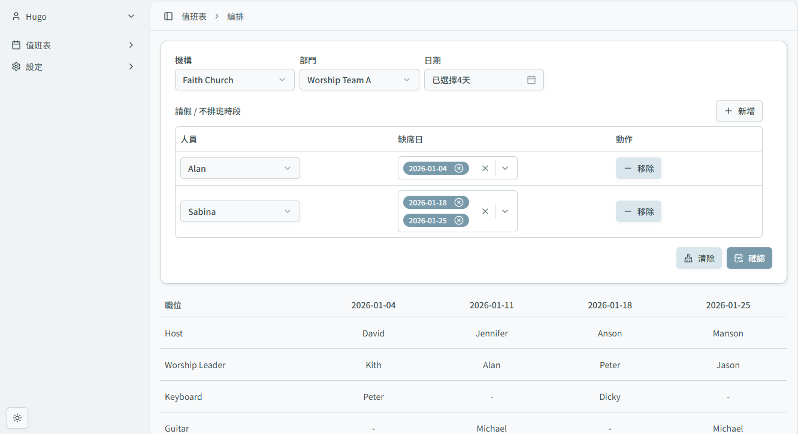

<div align="center">
  
  <h1>🗓️ Scheduler</h1>
  <p><strong>Roster Management System</strong></p>

  [](LICENSE)
  [](https://nextjs.org/)
  [](https://fastapi.tiangolo.com/)
  [](https://scheduler.faithnology.com)

  
</div>

---

## ✨ Key Features
- 🧠 **Intelligent Optimization**: Auto-generate optimized roster in seconds
- ⚙️ **Constraints Flexibilty**: Customize worker day-off and worker/post preferences
- 🖱️ **Drag-and-drop editor**: Instant interact with preview result
- 📤 **Easy Export**: Export finished rosters to **XLSX** (Excel) - ready for sharing
- 👥 **Multi-team Support**: Manage multiple teams under one account
- 🌙 **Dark Mode**: Eye-friendly dark theme perfect for calm planning

## 🏯 Architecture

This full-stack application follows a clean separation of concerns:

```
scheduler/
├── frontend/          # Next.js App - Dashboard & Interactions
│   └── web/
│       ├── app/
│       └── ...
└── backend/           # FastAPI - Roster Engine
    └── sch/
        ├── routers/
        └── services/
        └── ...
```

- **Frontend** (Next.js + TypeScript): Handles user interactions, previews, drag-and-drop editing, and UI rendering.
- **Backend** (FastAPI + Python): Powers the core roster optimization engine using Google OR-Tools constraint solver, API endpoints, and data processing.

## 🏗️ Tech Stack

- **Framework**: [Next.js 15](https://nextjs.org/), [FastAPI 0.115](https://fastapi.tiangolo.com/)
- **Language**: [TypeScript](https://www.typescriptlang.org/), [Python](https://www.python.org/)
- **Scheduling Engine**: [Google OR-Tools](https://developers.google.com/optimization)
- **Styling**: [Shadcn](https://ui.shadcn.com/), [Radix UI](https://www.radix-ui.com/), [Tailwind CSS](https://tailwindcss.com/), [Lucide React](https://lucide.dev/)
- **Drag-and-drop**: [Dnd Kit](https://dndkit.com/)
- **ORM**: [Prisma](https://www.prisma.io/)
- **Email API**: [Resend](https:///resend.com/)

## 🚀 Getting Started

Clone repository:

```bash
git clone git@github.com:CCMok/scheduler.git
```

### Frontend

#### Prerequisites

- Node.js 22+
- yarn (corepack enable)

#### Installation

1. Install dependencies:

```bash
cd frontend/web
yarn install
```

2. Create a `.env` file base on `.env.example`.
 
3. Run the development server:

```bash
yarn dev
```

Your app is now running on http://localhost:3000.

---

### Database

1. Create a Postgres database

```psql
CREATE DATABSE scheduler;
```

2. Navigate to the frontend directory:

```bash
cd frontend/web
```

3. Update `.env`:

```env
DATABASE_URL=your_database_connection_string
```

4. Migrate database and generate latest prisma client.

```bash
yarn prisma migrate dev
```

5. Seed data

```bash
yarn seed-system
```

Your database is ready.

---

### Backend

#### Prerequisites

- Python 3.11+

#### Installation

1. Navigate to the backend directory:

```bash
cd backend/sch
```

2. Create and activate a virtual environment:

```bash
python -m venv venv
venv\Scripts\activate  # Windows
# source venv/bin/activate  # macOS/Linux
```

3. Install dependencies:

```bash
pip install -r requirements.txt
```

4. Create a `.env` file based on `.env.example`.

5. Run the development server:

```bash
fastapi dev main.py
```

Your API is now running on http://localhost:8000.

---

<div align="center">
  <p>Made with ❤️ by Hugo Mok</p>
</div>